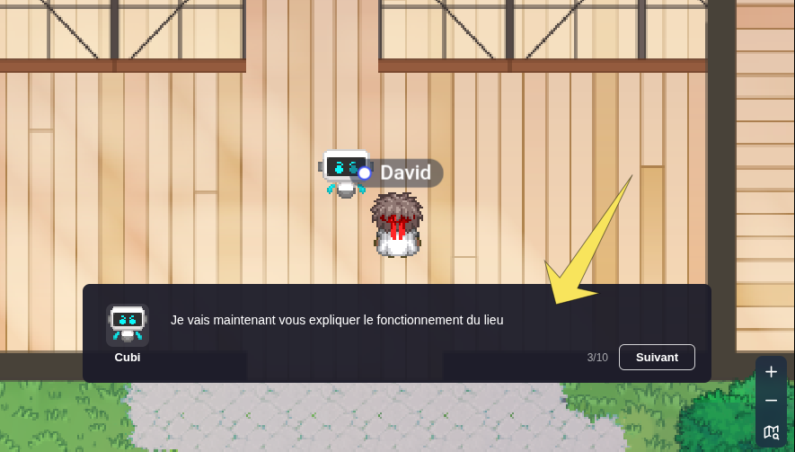

# @workadventure/npc-dialog-box

Embed a video-game-like NPC dialog box in your [WorkAdventure](https://workadventu.re) map.

When your script opens a dialog, a box appears at the bottom of the screen with your
NPC's avatar and name, and the text unfolds with a Zelda-like typewriter effect.
A click anywhere on the box (or the space key) reveals the rest of the text, moves
to the next step, or closes the dialog. Between steps, you can trigger any effect
you like — pan the camera, play a sound...



## Usage

Install the package:

```bash
npm install @workadventure/npc-dialog-box
```

Add the Vite plugin to your map project's Vite config(s) — for the map-starter-kit,
both `web.vite.config.ts` and `buildmap.vite.config.ts`:

```ts
import { npcDialogBox } from "@workadventure/npc-dialog-box/vite";

export default defineConfig({
    // ...
    plugins: [
        npcDialogBox({ assets: ["npc-avatar.png"] }),
        // ...the other plugins (map optimizers, etc.)
    ],
});
```

It makes the dialog page available next to your map, in dev and in your build,
along with any extra files you list in `assets` (your avatar images, typically).

Then open dialogs from your map script:

```ts
import { openDialog, closeDialog } from "@workadventure/npc-dialog-box";

WA.room.area.onEnter("myNpcZone").subscribe(() => {
    openDialog(
        [
            { text: "Hello, adventurer!" },
            {
                text: "Look at this room on your right...",
                // Runs when the step is displayed - move the camera,
                // play a sound, whatever you like.
                onDisplay: () => WA.camera.set(1200, 800, 600, 400, true, true, 1000),
            },
            { text: "Good luck!" },
        ],
        {
            name: "Robby",
            avatar: "npc-avatar.png",
            nextLabel: "Next",
            closeLabel: "Bye",
        },
    ).then(() => {
        // The dialog was closed.
        WA.camera.followPlayer(true);
    });
});

// Close the dialog when the player walks away
WA.room.area.onLeave("myNpcZone").subscribe(() => {
    closeDialog();
});
```

`openDialog(steps, options)` resolves when the dialog closes. Options:

| Option       | Default             | Description                                                 |
| ------------ | ------------------- | ----------------------------------------------------------- |
| `name`       | –                   | NPC name displayed under the avatar                         |
| `avatar`     | –                   | Avatar image URL (absolute, or relative to the dialog page) |
| `nextLabel`  | `"Next"`            | Label of the button while more steps remain                 |
| `closeLabel` | `"Close"`           | Label of the button on the last step                        |
| `dialogUrl`  | `"npc-dialog.html"` | URL of the dialog page, relative to the map file            |
